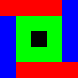

# NonogramLib
This is a C# library for nonograms.
Nonograms are a type of grid-based puzzle where cells are filled based on the amount of adjacent squares.
For more information on nonograms, [read this article](https://en.wikipedia.org/wiki/Nonogram).

## How to use
### Microsoft Visual Studio
Download or fork the source code and open the project or solution included in the local copy.
If you don't need to change the code, you can also download the .dll assembly from the releases page and reference it in your project.
### Visual Studio Code
Make sure to install the [C# Dev Kit](https://marketplace.visualstudio.com/items?itemName=ms-dotnettools.csdevkit).
Download or fork the source code and open the folder containing the local copy.
Like in Visual Studio, you can also use the .dll assembly.

## File format
A hex editor is recommended to edit puzzle files directly.
### General structure
- "File signature" (1 byte)
- Other data
- Width (1 byte)
- Height (1 byte)
- Cell data

If the file is too short to contain all of the cell data, the remaining cells will be blank.
### Black and white
The file signature is `0x00`.

There is no data between the file signature and the size data.\
A byte in the cell data represents 8 cells, from left to right. Each bit indicates whether each cell is filled in (1) or not (0).\
For example: `0x65 => 0b01100101 => □■■□□■□■`

### Color
The file signature is `0xFE`.
The byte following it denotes the size of the color palette.\
Every four bytes after that represents the channels of each color in this order: Red, Green, Blue, Alpha.\
After the specified number of colors are represented, each cell is represented by a byte which is its color index.

**Sample file**
```
FE => signature
04 => palette size: 4 colors
00 00 00 FF => Color #1 (BG): #000000 (black)
FF 00 00 FF => Color #2: #FF0000 (red)
00 FF 00 FF => Color #3: #00FF00 (green)
00 00 FF FF => Color #4: #0000FF (blue)
05 05 => width: 5; height: 5

Cell data:
01 01 01 01 03
03 02 02 02 03
03 02 00 02 03
03 02 02 02 03
03 01 01 01 01
```
Result:\
